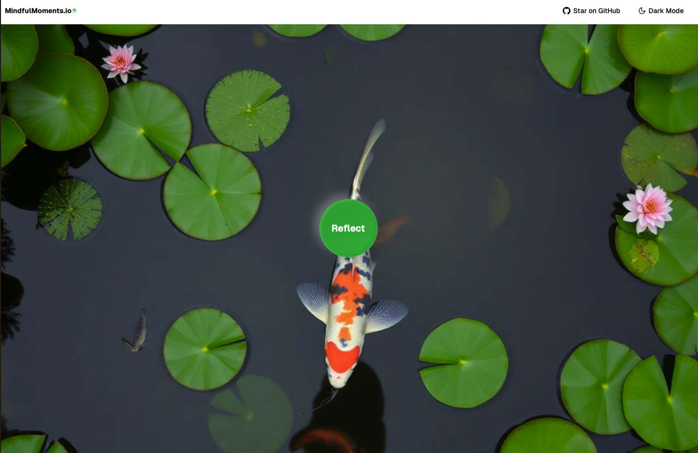

<div align="center">
  <h1>MindfulMoments.io</h1>
  <p>A wellness and reflection app powered by Hume AI</p>
</div>



## Overview

MindfulMoments.io is a wellness and reflection app powered by Hume AI that helps users maintain balance through emotional awareness, mindfulness practices, and personalized insights. The app transforms the Hume EVI starter template into a comprehensive wellness application focused on emotional balance, self-reflection, and mindfulness.

## Features

- **Emotional Awareness**: Multi-modal emotional analysis using video, voice, and text
- **Mindfulness Practices**: Guided meditation modules with ambient sounds
- **Personalized Insights**: Four-vector memory system for contextual understanding
- **Balance Tracking**: Consistency monitoring and adaptive scheduling
- **Frustration Management**: "429 Protection" to detect stress and provide calming interventions

## Getting Started

### Prerequisites

- Node.js 18.x or higher
- Hume AI API keys

### Installation

1. Clone the repository:
   ```bash
   git clone https://github.com/mindfulmoments/mindfulmoments.io.git
   cd mindfulmoments.io
   ```

2. Install dependencies:
   ```bash
   npm install
   # or
   yarn install
   # or
   pnpm install
   ```

3. Create a `.env.local` file in the root directory and add your Hume API keys:
   ```
   HUME_API_KEY=your_api_key
   HUME_SECRET_KEY=your_secret_key
   ```

4. Start the development server:
   ```bash
   npm run dev
   # or
   yarn dev
   # or
   pnpm dev
   ```

5. Open [http://localhost:3000](http://localhost:3000) in your browser to see the application.

## Documentation

For detailed documentation about the project architecture and development plan, see the [docs](./docs) directory.

## Acknowledgments

This project is built on top of Hume's [Empathic Voice Interface](https://hume.docs.buildwithfern.com/docs/empathic-voice-interface-evi/overview) using Hume's React SDK.

## Support

If you have questions or need assistance, please open an issue in the repository.
