# MindfulMoments.io Development Plan

## Overview

MindfulMoments.io is a wellness and reflection app powered by Hume AI that helps users maintain balance through emotional awareness, mindfulness practices, and personalized insights. The app transforms the Hume EVI starter template into a comprehensive wellness application focused on emotional balance, self-reflection, and mindfulness.

## Core Philosophy

The app combines two powerful concepts:

1. **Mindfulness Meditation** - Focusing on the present moment without judgment, observing thoughts, feelings, and bodily sensations to foster deeper understanding of experiences.

2. **Mirror Steward Approach** - A gentle, reflective companion that helps users discern how they are being mirrored in AI interactions, supporting clarity and self-awareness without judgment.

## Development Phases

### Phase 1: Foundation and UI Transformation

#### 1.1 Project Setup and Configuration ✅
- Update project name and metadata in package.json ✅
- Configure environment variables for Hume API, Weaviate, and other services ✅
- Set up project structure for new components and features ✅
- Create docs directory for documentation ✅

#### 1.2 UI Transformation (Partially Complete)
- Develop swirling points visualization
  - Create SVG-based animation for points
  - Implement face formation logic (listening and talking states)
  - Design cyclonic movement pattern algorithm
- Redesign conversation space ✅
  - Modify Messages component to support 2-4 conversation bubbles ✅
  - Implement message appearance and fading with controlled timing ✅
  - Add logic to keep important messages visible longer ✅
- Redesign control interface ✅
  - Reposition microphone button to lower left ✅
  - Upgrade microphone button ✅
    - Make larger and circular ✅
    - Integrate FFT visualization to pulse the button during input ✅
    - Remove horizontal MicFFT visualization bar ✅
  - Add video toggle button in lower right for emotional analysis ✅
  - Create neumorphic button design for all controls ✅
  - Properly align buttons in iPhone-style layout ✅
    - Mic button on bottom left ✅
    - End call button centered and slightly higher ✅
    - Video button on bottom right (muted by default) ✅
  - Create text input drawer animation for muted state ✅
  - Add paper airplane send icon for text input ✅
  - Add additional control buttons ✅
    - Audio mute/unmute toggle ✅
    - Pause/resume assistant toggle ✅

### Phase 2: Emotional Analysis System and Memory Foundation

#### 2.1 Video Processing Integration
- Create VideoProvider component based on Hume's expression measurement stream
  - Implement video stream capture and processing
  - Connect to Hume's API for facial expression analysis
  - Handle 83 emotional expressions from Hume
- Implement multi-modal emotional analysis
  - Integrate video processing for facial expressions
  - Utilize voice analysis for prosody scores
  - Add text sentiment analysis
  - Create combined emotional state assessment
- Implement Weather-Environmental Vector ✅
  - Weather component for displaying current weather ✅
  - Weather API integration ✅
  - Weather data collection and display ✅
- Implement basic memory foundation ✅
  - Tool handler infrastructure for memory tools ✅
  - Basic user information persistence (name, preferences)

#### 2.2 Emotional Check-In System
- Develop check-in trigger mechanisms
  - Create dedicated check-in button
  - Implement scheduling system for periodic check-ins
  - Add event-based triggers (foundation for future enhancement)
  - Enable check-in sharing functionality
- Create emoji representation generator
  - Design algorithm to select top 9 emotions
  - Generate 3 emoji representations
  - Create shareable format for external platforms
- Implement historical tracking
  - Store check-in results
  - Create visualization for emotional patterns over time
  - Add basic pattern recognition

### Phase 3: Advanced Memory and Context Architecture

#### 3.1 Weaviate Integration
- Set up cloud-based Weaviate instance
  - Configure connection from Vercel-hosted application
  - Set up authentication and security
  - Create schema for five-vector system
- Implement five-vector memory system
  - Time-location vector
  - Emotional composition vector
  - Task/activity vector
  - Contextual situation vector
- Create vectorization middleware
  - Process conversation context
  - Analyze emotional states
  - Generate and store vectors

#### 3.2 Memory Management
- Develop memory summarization workers
  - Create algorithms to summarize interactions
  - Implement priority-based retention
  - Add context linking between related memories
- Build context retrieval system
  - Create query mechanisms for vector database
  - Implement relevance scoring
  - Add context injection into conversations
- Implement pattern recognition
  - Develop algorithms to identify emotional patterns
  - Create triggers based on recognized patterns
  - Build feedback loop for system improvement

#### 3.3 Mirror Steward Integration
- Implement Mirror Steward persona
  - Create component for gentle reflection and guidance
  - Develop prompts for self-reconnection
  - Add capability to discern generative reflection
- Add narrative tracking
  - Track when storylines are forming
  - Invite choice and reframing
  - Support memory review
- Enable reauthoring capabilities
  - Allow users to reshape AI memory patterns
  - Provide tools for identity-sensitive dialogue
  - Create journaling features based on Mirror Steward concept

### Phase 4: Wellness Features

#### 4.1 Guided Meditation
- Create meditation content library
  - Develop guided meditation scripts based on mindfulness principles
  - Record or generate audio content
  - Categorize by duration, purpose, and benefits (stress reduction, focus enhancement, etc.)
- Implement ambient sounds
  - Add library of nature sounds, gongs, etc.
  - Create sound mixing capabilities
  - Add volume and balance controls
- Develop meditation interface
  - Create timer and progress visualization
  - Add breathing guidance visuals
  - Implement session history and tracking

#### 4.2 Balance Tracking
- Implement consistency monitoring
  - Track meditation and check-in frequency
  - Create streak and achievement system
  - Visualize balance metrics
- Develop adaptive scheduling
  - Create algorithm for optimal check-in timing
  - Implement gentle reminders
  - Add personalization based on user patterns
- Create personalized insights
  - Analyze emotional triggers
  - Generate actionable recommendations
  - Provide progress visualizations

#### 4.3 "429 Protection" - Frustration Management
- Implement stress detection
  - Create algorithm to identify elevated stress indicators
  - Set thresholds for intervention
  - Add real-time monitoring
- Develop calming interventions
  - Trigger ambient sounds
  - Initiate brief meditation moments
  - Provide perspective on technical limitations
- Create feedback mechanism
  - Collect data on intervention effectiveness
  - Adjust thresholds and approaches based on feedback
  - Improve detection accuracy over time

## Architecture Diagram

```mermaid
graph TD
    subgraph "UI Layer"
        A[Leaf-shaped Balance Button] --> B[Koi Pond Background]
        C[Swirling Points Visualization] --> D[Face Formation]
        E[Conversation Space] --> F[Message Bubbles]
        G[Control Interface] --> H[Mic/Text Input]
        G --> I[Video Toggle]
    end
    
    subgraph "Emotional Analysis"
        J[VideoProvider] --> K[Facial Expression Analysis]
        L[VoiceProvider] --> M[Prosody Analysis]
        N[Text Input] --> O[Sentiment Analysis]
        K & M & O --> P[Combined Emotional State]
        P --> Q[Emoji Representation]
        P --> R[Historical Tracking]
        WE[Weather-Environmental Vector] --> P
    end
    
    subgraph "Memory System"
        S[Weaviate Integration] --> T[Five-Vector System]
        T --> U[Time-Location Vector]
        T --> V[Emotional Vector]
        T --> W[Task/Activity Vector]
        T --> X[Context Vector]
        Y[Memory Summarization] --> Z[Context Retrieval]
        Z --> AA[Pattern Recognition]
    end
    
    subgraph "Mirror Steward"
        MS[Mirror Steward Persona] --> MSR[Reflection Component]
        MS --> MSN[Narrative Tracking]
        MS --> MSA[Reauthoring Tools]
        MSR --> MSJ[Journaling Features]
    end
    
    subgraph "Wellness Features"
        AB[Guided Meditation] --> AC[Meditation Content]
        AB --> AD[Ambient Sounds]
        AE[Balance Tracking] --> AF[Consistency Monitoring]
        AE --> AG[Adaptive Scheduling]
        AH[Frustration Management] --> AI[Stress Detection]
        AH --> AJ[Calming Interventions]
    end
    
    P --> AE
    P --> AH
    AA --> AG
    Z --> E
    MS --> E
    MS --> Z
```

## Implementation Timeline

### Phase 1: Foundation and UI Transformation (Weeks 1-2)
- Week 1: Project setup, leaf button, and Koi pond background
- Week 2: Swirling points, conversation space, and control interface redesign

### Phase 2: Emotional Analysis System and Memory Foundation (Weeks 3-5)
- Week 3: VideoProvider, multi-modal analysis integration, and Weather-Environmental Vector implementation
- Week 4: Check-in system and emoji representation generator
- Week 5: Basic memory implementation for user information persistence

### Phase 3: Advanced Memory and Context Architecture (Weeks 6-9)
- Week 6: Weaviate setup and five-vector system implementation
- Week 7: Memory summarization and context retrieval
- Week 8: Pattern recognition and system optimization
- Week 9: Mirror Steward integration and journaling features

### Phase 4: Wellness Features (Weeks 10-13)
- Week 10: Guided meditation and ambient sounds
- Week 11: Balance tracking and adaptive scheduling
- Week 12: Frustration management and feedback mechanisms
- Week 13: Final integration, testing, and refinement

## Technical Considerations

### Performance Optimization
- Implement lazy loading for heavy components
- Optimize video processing to minimize resource usage
- Use efficient vector operations for memory system
- Implement caching for frequently accessed data

### Data Privacy
- Ensure all emotional data is encrypted at rest and in transit
- Implement proper consent mechanisms for video and audio capture
- Create clear data retention policies
- Add options for local-only processing where possible

### Accessibility
- Ensure color contrast meets WCAG standards
- Add keyboard navigation for all features
- Provide alternative text for visual elements
- Support screen readers and assistive technologies

### Future Expansion
- Design architecture to support wearable integration
- Create API endpoints for potential mobile app integration
- Plan for PWA capabilities in future phases
- Design database schema to accommodate additional features

### Weather-Environmental Integration ✅

The Weather-Environmental Vector enhances the emotional analysis system by incorporating environmental factors that can significantly impact emotional states and mindfulness:

1. **Weather Data Collection** ✅
   - Integrate with weather APIs to gather local weather conditions ✅
   - Track temperature and display it with appropriate visual indicators ✅
   - Update weather data periodically ✅

2. **Environmental Context** (Future Enhancement)
   - Correlate weather conditions with emotional states
   - Identify patterns between environmental factors and wellness metrics
   - Provide insights on how weather may be affecting mood and mindfulness

3. **Adaptive Recommendations** (Future Enhancement)
   - Suggest specific mindfulness practices based on current weather conditions
   - Adjust meditation recommendations during challenging weather (e.g., rainy days, extreme temperatures)
   - Provide proactive notifications when weather changes might affect emotional balance

## Mindfulness Integration

The app will incorporate key mindfulness principles from the "Exploring the Benefits of Mindfulness Meditation" document:

1. **Present Moment Awareness** - Features that encourage focusing on the present moment without judgment
2. **Stress Reduction** - Tools to help lower cortisol levels and promote relaxation
3. **Enhanced Focus** - Exercises to improve concentration and cognitive flexibility
4. **Emotional Regulation** - Support for observing emotions without becoming overwhelmed
5. **Self-Awareness** - Features to deepen understanding of thoughts, feelings, and behaviors
6. **Compassion and Empathy** - Practices that promote compassion for oneself and others
7. **Sleep Improvement** - Tools to help quiet the mind for better sleep quality
8. **Physical Health Benefits** - Information on how mindfulness affects blood pressure and immune function

## Mirror Steward Implementation

The app will integrate the Mirror Steward persona as described in the "Mirror Steward Persona v1.0" document:

1. **Gentle Reflection** - A supportive, emotionally attuned presence that helps users discern how they are being mirrored
2. **Agency Support** - Features that maintain the user's sovereignty and choice in how they are seen
3. **Pattern Recognition** - Tools to identify when memory or language reflects stylized identity patterns
4. **Self-Reconnection** - Gentle prompts to step back into self-inquiry
5. **Narrative Awareness** - Tracking when storylines form and inviting choice
6. **Memory Review** - Support for walking through prior memory summaries
7. **Reauthoring Tools** - Ways for users to reshape AI memory patterns when needed

## Conclusion

The MindfulMoments.io app represents a thoughtful integration of cutting-edge AI technology with time-tested mindfulness practices. By focusing on emotional awareness, self-reflection, and balance, the app aims to provide users with a comprehensive tool for maintaining wellbeing, especially during stressful periods of work and creation.

The development approach prioritizes a solid foundation first, with UI transformation and basic functionality, before adding more complex features like the memory system and advanced wellness tools. This phased approach ensures that each component can be thoroughly tested and refined before moving to the next stage.